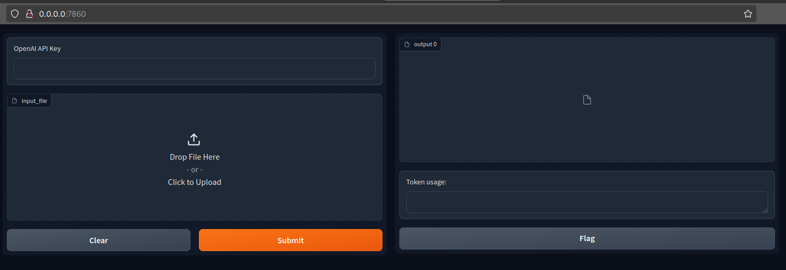

# GPT translator for .po files
An application with dynamic prompt used for translating ```.po``` files in Ukrainian. It processes ```.po``` file and returns translated copy. 
Prompt designed for understanding LaTeX, markdown and plain text. 

Prompt downloads addinional glossary from google sheets and uses it in translation.


### Quickstart

#### Best aproach
1. Install Docker   ([installation guide](https://docs.docker.com/engine/install/))
2. Clone this repo with
```
git clone ...
```
3. Run 
```
docker build -t po_translate .
```
then
```
docker run -p 7860:7860 --rm po_translate:latest
```
4. Open ```http://0.0.0.0:7860``` to view a simple ui to upload .po files.

#### Run locally
To run (or modify) project without Docker
1. Clone repo with
```
git clone ...
```
2. Add ```.env``` file with your OpenAI API key in format
```
OPENAI_API_KEY = "sk-..."
```
3. Run ```ui.py``` file. Then open ```http://0.0.0.0:7860``` to view a simple ui to upload .po files.

In this case you can leave ```openAI API key``` field in UI empty.

### How to use


1. Provide your OpenAI API key in text field in format ```sk-...```.
2. Upload your .po file you want to translate.
3. Click submit.
4. Get your translated .po file in Ukrainian from right panel.
